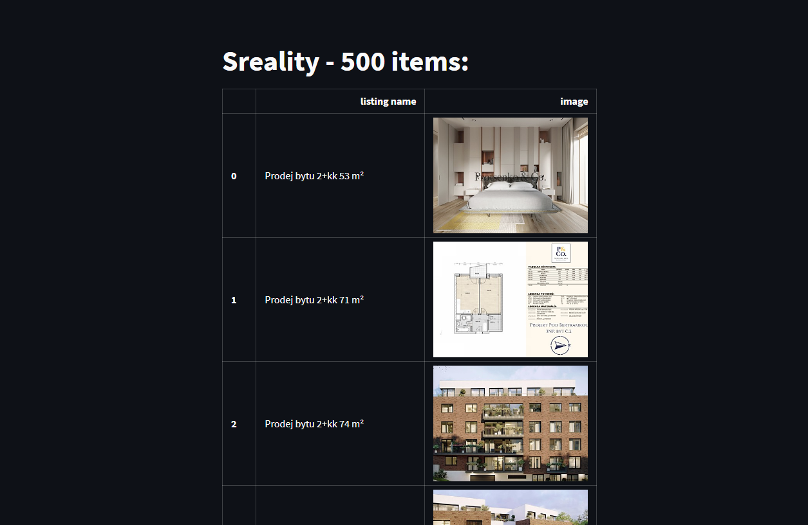

## Flat listings scraper - sreality

You will need only `docker-compose.yml`, images are uploaded to dockerhub.

Run command: `docker compose up`. Loading 500 results will take a couple of minutes.

On start `server` service will:
 - collect listings with `scrapy` (number of listings is configurable, see SPIDER_MAX_RESULTS in `docker-compose.yml`)
 - put listings to database 
 - run `streamlit` server with collected results

Services:
 - postgres database
 - server

